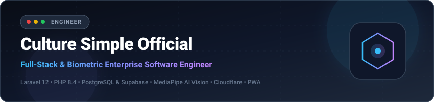

  

 

  
  
  

 

### 👨‍💻 Profil Singkat
Saya adalah pengembang perangkat lunak berbasis di Kediri, Jawa Timur, dengan fokus utama pada perancangan dan pembangunan aplikasi web operasional berskala produksi. Keseharian saya berpusat pada ekosistem **Laravel**, integrasi database relasional **PostgreSQL**, optimasi penyimpanan berbasis cloud, serta penerapan visi komputer biometrik di sisi klien.

Mayoritas kode sumber dan repositori saya berstatus **privat** karena merupakan sistem internal instansi, modul bisnis komersial, dan solusi berorientasi klien yang terikat hak cipta kepemilikan.

---

### 🛠️ Keahlian & Teknologi Inti

| Lapisan Sistem | Teknologi | Catatan Implementasi |
|---|---|---|
| **Backend Framework** | `PHP 8.4` • `Laravel 12` • `Node.js` | Arsitektur service-repository, queue workers, dan API terenkripsi |
| **Database & Cache** | `PostgreSQL 16` • `Supabase` • `Redis` | Skema relasional terindeks, Row Level Security, dan in-memory caching |
| **Frontend & Mobile** | `Tailwind CSS 4` • `Modern JS (ES6+)` • `PWA` | Antarmuka mobile-first, Progressive Web App, dan Android TWA |
| **Biometrik & Visi Komputer** | `Google MediaPipe (Face Landmarker)` | Ekstraksi 468 titik wajah via WebAssembly (WASM) di browser |
| **Infrastruktur & Server** | `Ubuntu 24.04 LTS` • `Nginx` • `Cloudflare` | Reverse proxy, WAF, SSL otomatis, dan otomatisasi deployment |

---

### 💼 Studi Kasus Rekayasa Sistem

Berikut adalah contoh sistem produksi komersial yang telah saya rancang dan operasikan:

#### 1. 🏢 AbsenKita: Sistem Presensi Karyawan PWA & Biometrik Wajah
* **Latar Masalah:** Kebutuhan presensi lapangan yang akurat tanpa kecurangan titip absen atau manipulasi lokasi GPS, sekaligus menjaga agar server tidak terbebani streaming video dari ratusan karyawan.
* **Solusi Arsitektur:**
  - **Deteksi Wajah di Klien (WASM):** Menggunakan MediaPipe Face Landmarker di browser untuk memverifikasi 4 gerakan acak (liveness). Data video tidak dikirim ke server; server hanya menerima vektor deskriptor dan 1 foto final.
  - **Validasi Server-Side:** Menguji token keamanan sekali pakai (anti-replay), menghitung jarak koordinat kantor dengan rumus Haversine, dan memvalidasi kecocokan wajah dengan Cosine Similarity.
  - **Shift Malam Lintas Hari:** Algoritma penanggalan kerja cerdas untuk shift yang melewati tengah malam (misal 21.00 sampai 05.00) agar pencatatan rekapitulasi tetap sinkron dengan tanggal shift mulai.
* **Status:** Aktif beroperasi di server produksi VPS.

#### 2. 🛡️ Pipeline Penyimpanan Biometrik & Retensi Data Cerdas
* **Latar Masalah:** Kepatuhan terhadap UU Perlindungan Data Pribadi (UU PDP No. 27/2022) dan pencegahan penumpukan file foto lama yang tidak lagi terhubung ke akun aktif (file orphan).
* **Solusi Arsitektur:**
  - **Private Storage Bucket:** Foto wajah dan selfie disimpan di bucket privat Supabase, hanya dapat diakses melalui URL bertanda waktu sementara dengan masa kedaluwarsa 15 menit.
  - **Pembersihan Otomatis:** Saat karyawan mendaftar ulang wajah, sistem secara otomatis menghapus foto referensi lama di cloud storage.
  - **Kebijakan Retensi Audit:** Karyawan yang memiliki riwayat absensi dilindungi dari penghapusan permanen (hanya dapat dinonaktifkan) untuk menjaga rekam jejak audit perusahaan.

---

### 📐 Prinsip Rekayasa Perangkat Lunak
1. **Keamanan Berakar pada Desain:** Tidak ada data biometrik mentah yang disimpan tanpa enkripsi, dan setiap akses media dibatasi batas waktu ketat.
2. **Kemandirian Perangkat (Edge First):** Memanfaatkan daya komputasi perangkat pengguna untuk tugas berat seperti pemrosesan gambar, menjaga server tetap ringan dan responsif.
3. **Integritas Audit:** Data historis yang menyangkut operasional dan pembukuan tidak boleh hilang karena kesalahan teknis penghapusan akun.
4. **Otomatisasi Deployment:** Skrip rsync dengan pembersihan cache terpadu untuk memastikan pembaruan kode dapat meluncur ke server produksi tanpa gangguan layanan.

---

### 📬 Hubungi Saya
Untuk diskusi teknis seputar rekayasa perangkat lunak, arsitektur sistem, atau kolaborasi proyek:
- Email Resmi: **[culturesimpleofficial@gmail.com](mailto:culturesimpleofficial@gmail.com)**
